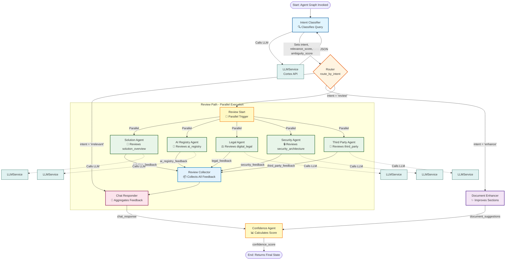
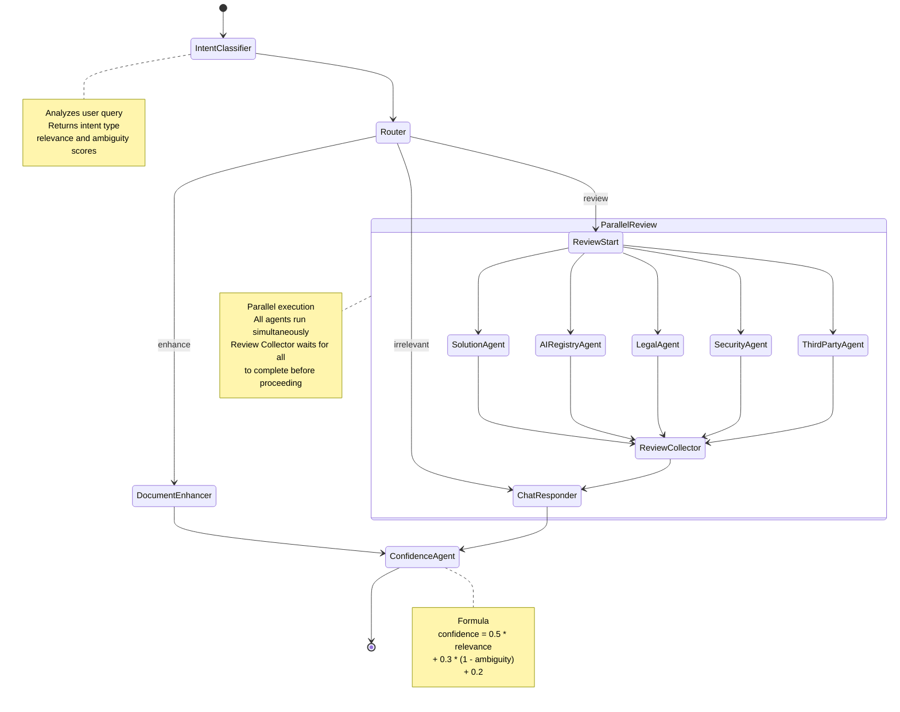
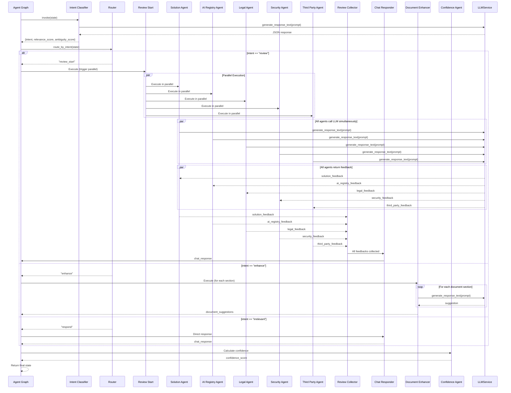
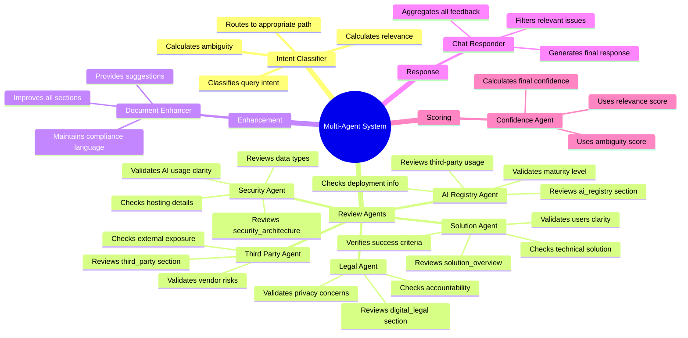
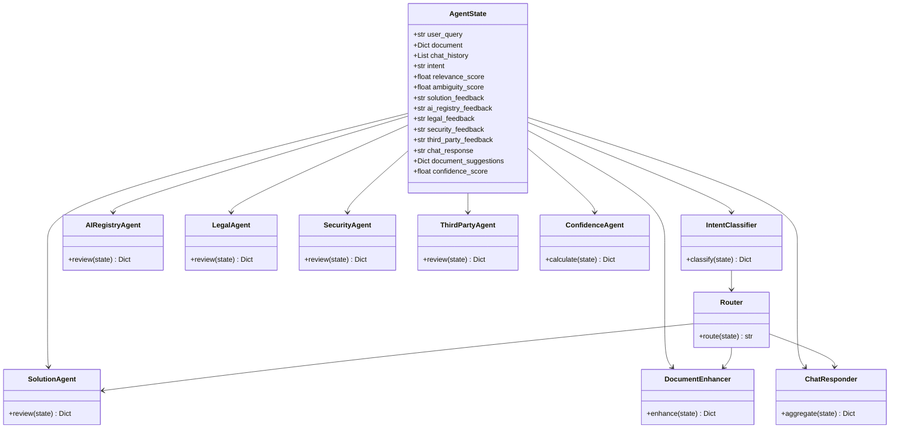

# Multi-Agent System Architecture

## Agent Graph Flow Diagram (Parallel Execution)

## Agent State Flow Diagram (Parallel Execution)

## Agent Execution Sequence (Parallel Execution)

## Agent Responsibilities

## Agent State Structure

