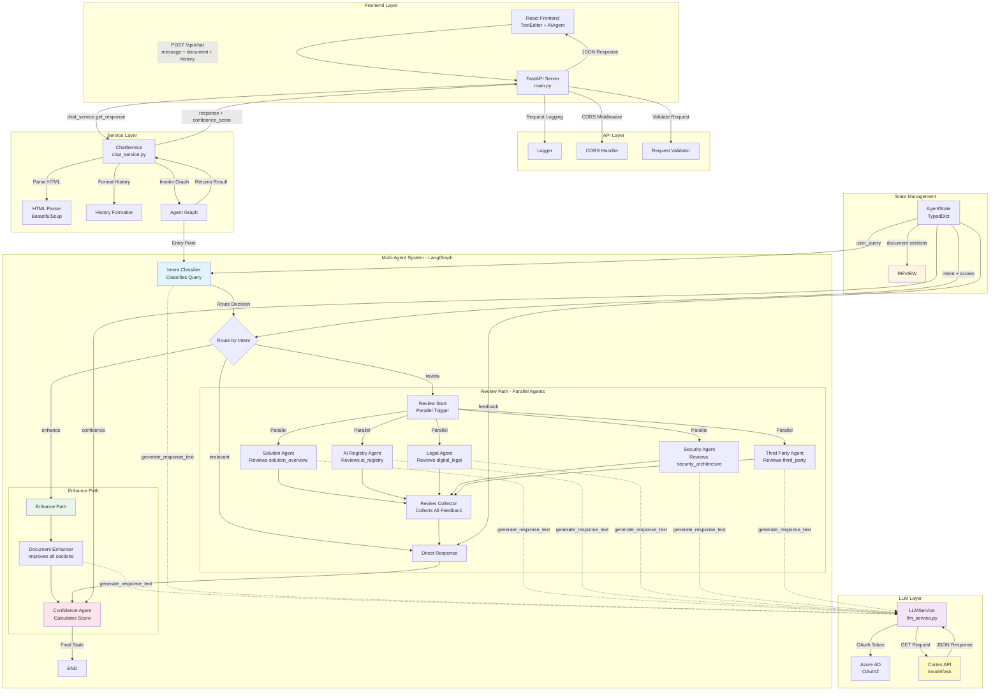
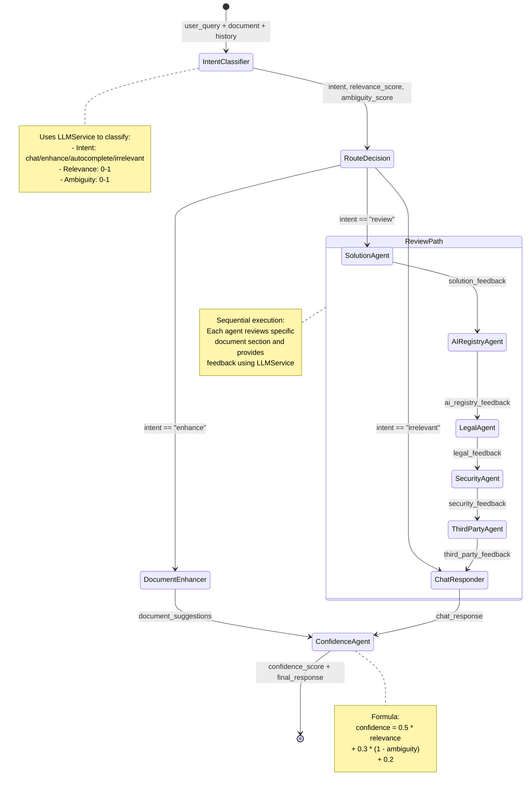
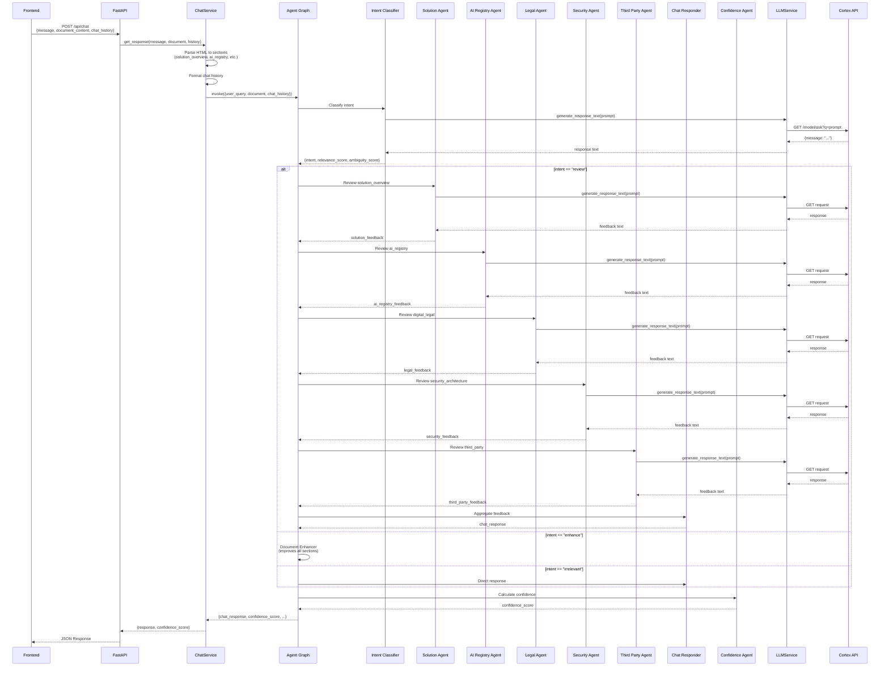

# Multi-Agent Idea Generator - Architecture Documentation

## System Architecture



## Agent Graph Flow Diagram



## Data Flow Diagram



## Component Details

### 1. Agent State (AgentState)
```python
{
    # Inputs
    "user_query": str,
    "document": {
        "solution_overview": str,
        "ai_registry": str,
        "digital_legal": str,
        "security_architecture": str,
        "third_party": str
    },
    "chat_history": List[str],
    
    # Intent & Routing
    "intent": "chat | enhance | autocomplete | irrelevant",
    "relevance_score": float (0-1),
    "ambiguity_score": float (0-1),
    
    # Agent Outputs
    "solution_feedback": str,
    "ai_registry_feedback": str,
    "legal_feedback": str,
    "security_feedback": str,
    "third_party_feedback": str,
    
    # Final Outputs
    "chat_response": str,
    "document_suggestions": Dict[str, str],
    "confidence_score": float (0-1)
}
```

### 2. Specialized Agents

| Agent | Section Reviewed | Checks For |
|-------|-----------------|-----------|
| **Solution Agent** | `solution_overview` | Missing technical solution, unclear users, missing success criteria |
| **AI Registry Agent** | `ai_registry` | Missing deployment info, missing maturity, third-party usage clarity |
| **Legal Agent** | `digital_legal` | Missing accountability, missing privacy concern clarity |
| **Security Agent** | `security_architecture` | AI usage clarity, hosting details, data types |
| **Third Party Agent** | `third_party` | External exposure, vendor risks |

### 3. Routing Logic

```python
if intent == "irrelevant":
    → Direct to Chat Responder
elif intent == "enhance":
    → Document Enhancer (improves all sections)
else:
    → Review Path (all 5 agents sequentially)
```

### 4. Confidence Score Calculation

```python
confidence = (
    0.5 * relevance_score +
    0.3 * (1 - ambiguity_score) +
    0.2
)
# Converted to 0-100% for frontend
```

## Key Features

1. **Intent-Based Routing**: Automatically routes queries to appropriate processing path
2. **Multi-Agent Review**: 5 specialized agents review different document sections
3. **Sequential Processing**: Agents execute in sequence, building on previous feedback
4. **Cortex API Integration**: All LLM calls go through Cortex API with OAuth
5. **HTML Parsing**: Automatically extracts document sections from HTML content
6. **Confidence Scoring**: Dynamic confidence calculation based on relevance and ambiguity
7. **Document Enhancement**: Can suggest improvements for all document sections

## Technology Stack

- **Frontend**: React + TypeScript + TipTap
- **Backend**: FastAPI (Python)
- **Agent Framework**: LangGraph
- **LLM**: Cortex API (via LLMService)
- **HTML Parsing**: BeautifulSoup4
- **Authentication**: Azure AD OAuth2
