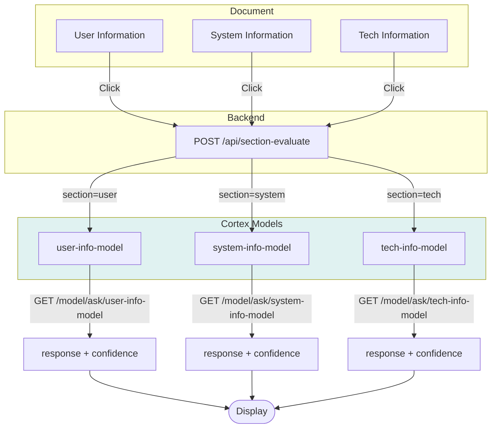
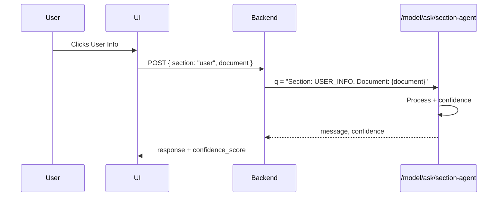
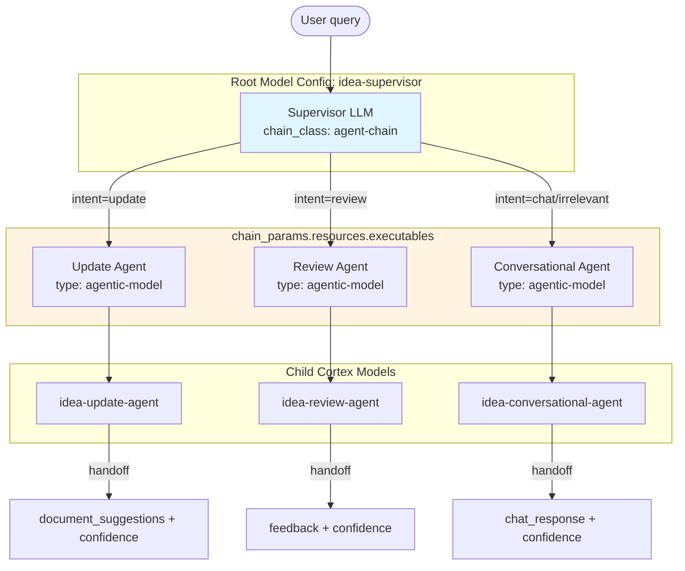
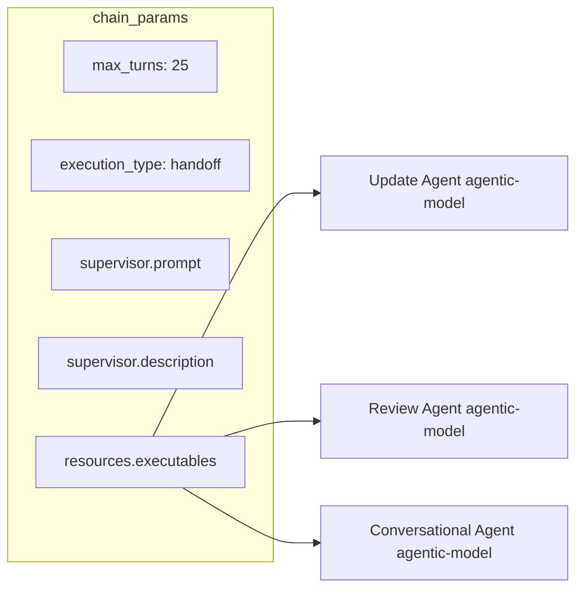
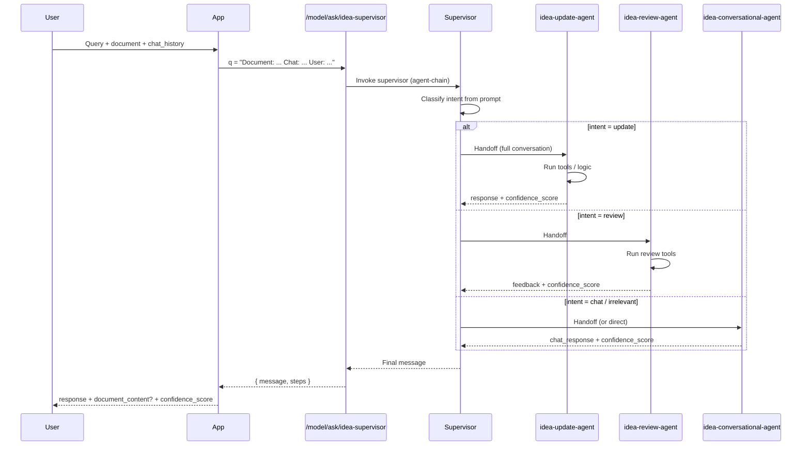
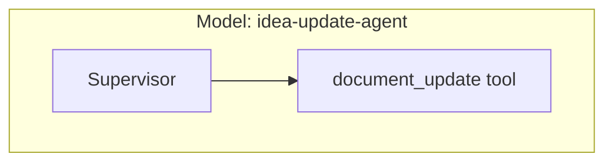
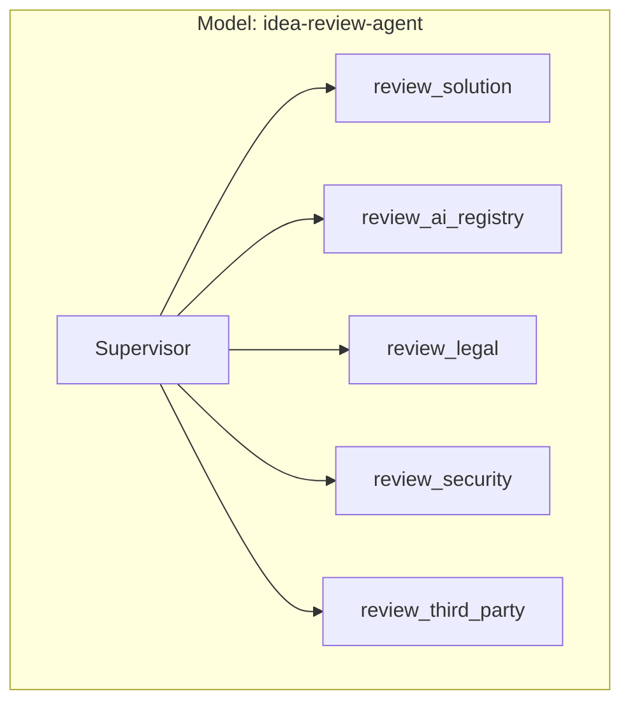
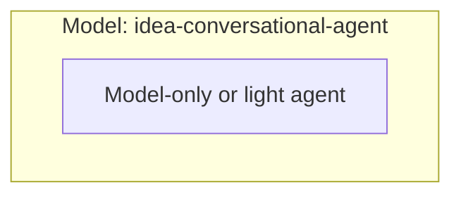

# Cortex Implementation — Agent Architecture

How the two flows (Document-based and Supervisor) are implemented on **Cortex** using the Agentic V2 framework, `agent-chain`, and `agentic-model` executables.

---

## Cortex Concepts Used

| Concept | Role |
|---------|------|
| **agent-chain** | Model config chain class; one supervisor LLM routes to executables. |
| **agentic-model** | Child agent = another Cortex model; supervisor hands off conversation. |
| **tool-call** | Tool from a Toolkit (gRPC/MCP); agent invokes for actions. |
| **/model/ask/{model}** | API to invoke a Cortex model with `q` (question). |
| **chain_params** | Supervisor prompt, resources (executables), max_turns, execution_type. |

---

## Flow 1: Document-Based Agents (Cortex)

Each document section (User / System / Tech info) triggers a **separate Cortex model** or a **single model with section parameter**. Backend calls `/model/ask/{model}` with the section and document context.

### Option A: Three separate Cortex models



### Option B: Single model with section in question



### Flow 1 — Cortex model config (per section)

Each section agent can be a **model-only-chain** or a light **agent-chain** with one tool that returns confidence. Example for one section:

```json
{
  "name": "user-info-agent",
  "chain": [{ "chain_class": "model-only-chain", ... }],
  "model_versions": [{ "model_class": "claude", "model_iteration": 17 }]
}
```

---

## Flow 2: Supervisor Agent (Cortex agent-chain)

The **Supervisor** is one Cortex model with **agent-chain**. It has three **agentic-model** executables: Update Agent, Review Agent, Conversational Agent. Each child is a separate Cortex model config.

### Cortex hierarchy



### chain_params (supervisor config)



### Request flow: /model/ask/idea-supervisor



### Child model: Update Agent (agentic-model)



### Child model: Review Agent (agentic-model)



### Child model: Conversational Agent (agentic-model)



Can be **model-only-chain** (no tools) or a minimal agent-chain. Supervisor may also handle conversational directly without handoff.

---

## Summary: Cortex Mapping

| Flow | Cortex implementation | Invocation |
|------|------------------------|------------|
| **Document** (User/System/Tech click) | One model per section, or one model with `q` including section | Backend → `GET /model/ask/{section-model}?q=...` |
| **Supervisor** (query → Update/Review/Conversational) | Root model: `agent-chain` with 3 `agentic-model` executables | Backend → `GET /model/ask/idea-supervisor?q=...` |

| Component | Cortex type | Config |
|-----------|-------------|--------|
| Root Supervisor | agent-chain | chain_params.supervisor + resources.executables (3 agentic-model) |
| Update Agent | agentic-model | Separate model; tools: document_update |
| Review Agent | agentic-model | Separate model; tools: 5 section reviewers |
| Conversational Agent | agentic-model | Separate model; model-only or minimal agent |
| User/System/Tech Info agents | model-only or agent-chain | One model per section or one parameterized model |
