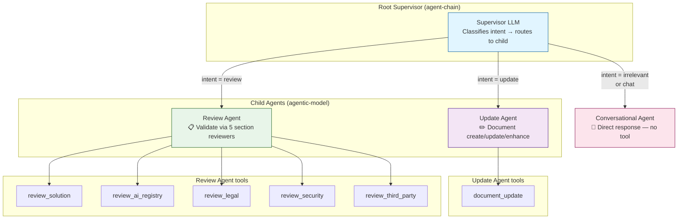
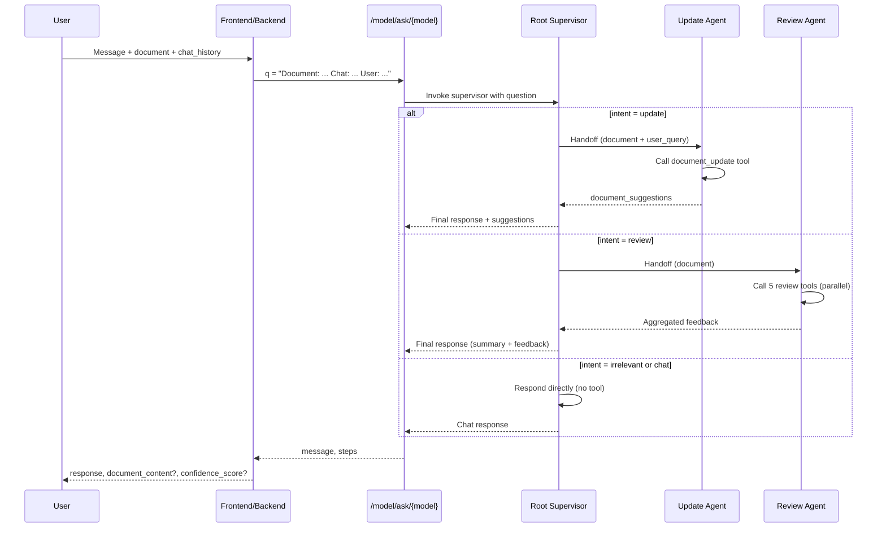
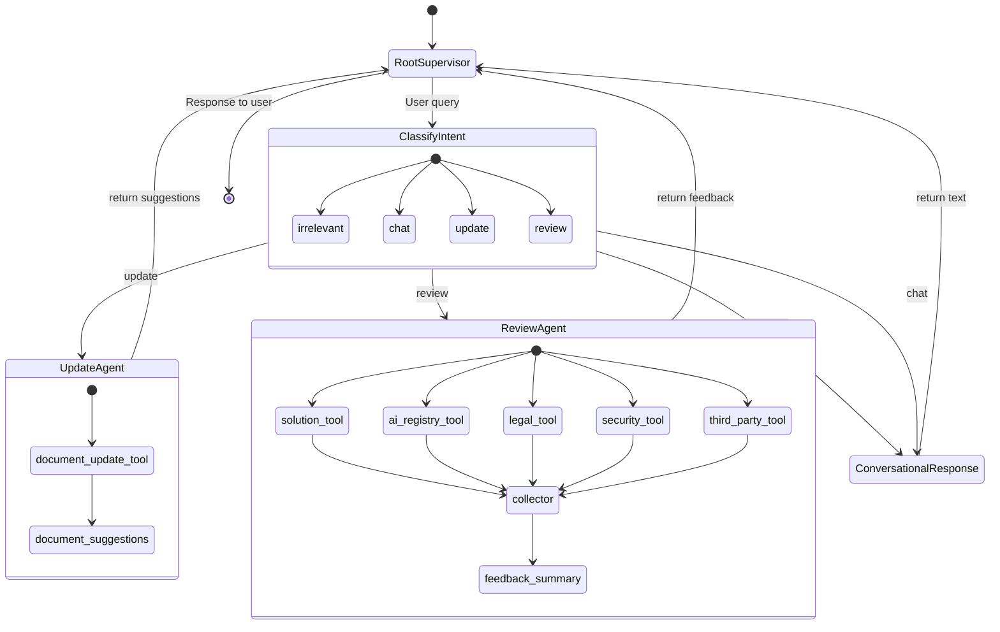
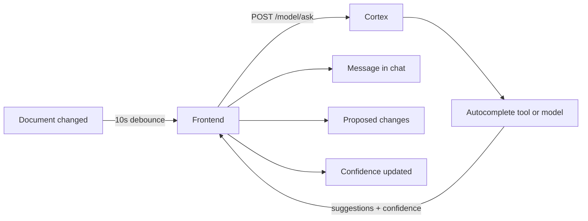

# Cortex Implementation — Agent Hierarchy (Mermaid Diagrams)

This document describes the **Cortex Agentic V2** implementation of the Idea Generator. The architecture uses a **root supervisor** that routes to **three child agents** based on user intent.

---

## Agent Hierarchy

```
Root Supervisor (agent-chain)
    ├── Update Agent     (agentic-model) — create/update/enhance document
    ├── Review Agent     (agentic-model) — validate document via 5 section reviewers
    └── Conversational Agent — irrelevant/chat; direct response (no child agent)
```

---

## Hierarchy Diagram



---

## Request Flow (Sequence)



---

## State / Routing Diagram



---

## Child Agent Details

| Child Agent           | Trigger Intent | Tools / Behavior | Output |
|-----------------------|----------------|------------------|--------|
| **Update Agent**      | update         | `document_update` | document_suggestions (section → content) |
| **Review Agent**      | review         | `review_solution`, `review_ai_registry`, `review_legal`, `review_security`, `review_third_party` | Aggregated feedback per section |
| **Conversational Agent** | irrelevant, chat | None (direct LLM response) | Chat message using document + history |

---

## Autocomplete (Separate Trigger)

The **Autocomplete** flow is **not** routed by the Root Supervisor. It is triggered by the frontend ~10s after document changes and can call a **separate Cortex model** or the same model with a special question prefix.



---

## Summary

- **Root Supervisor**: Single agent-chain; classifies intent and routes to Update Agent, Review Agent, or Conversational (direct) path.
- **Update Agent**: Child agent with `document_update` tool.
- **Review Agent**: Child agent with 5 section review tools.
- **Conversational Agent**: Handled by the supervisor itself when no tool/child is needed.
- **Autocomplete**: Separate trigger (10s after doc change); not part of the main hierarchy.
