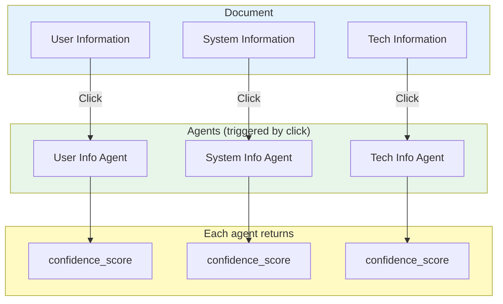
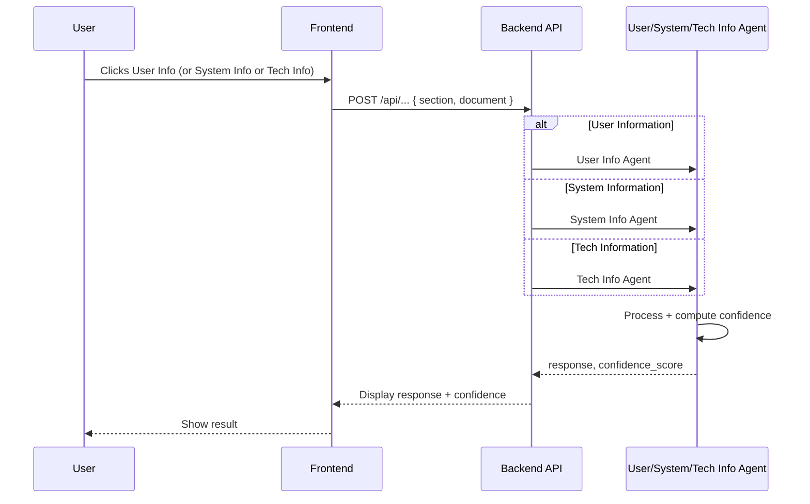
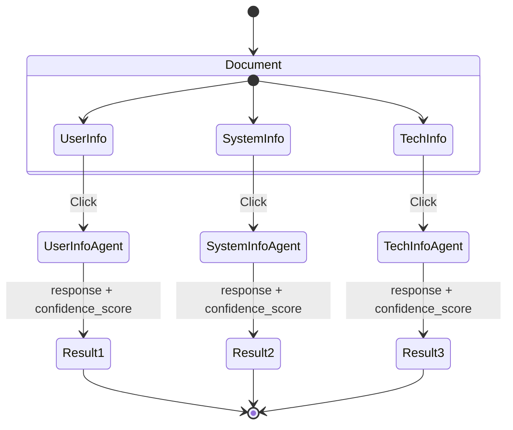
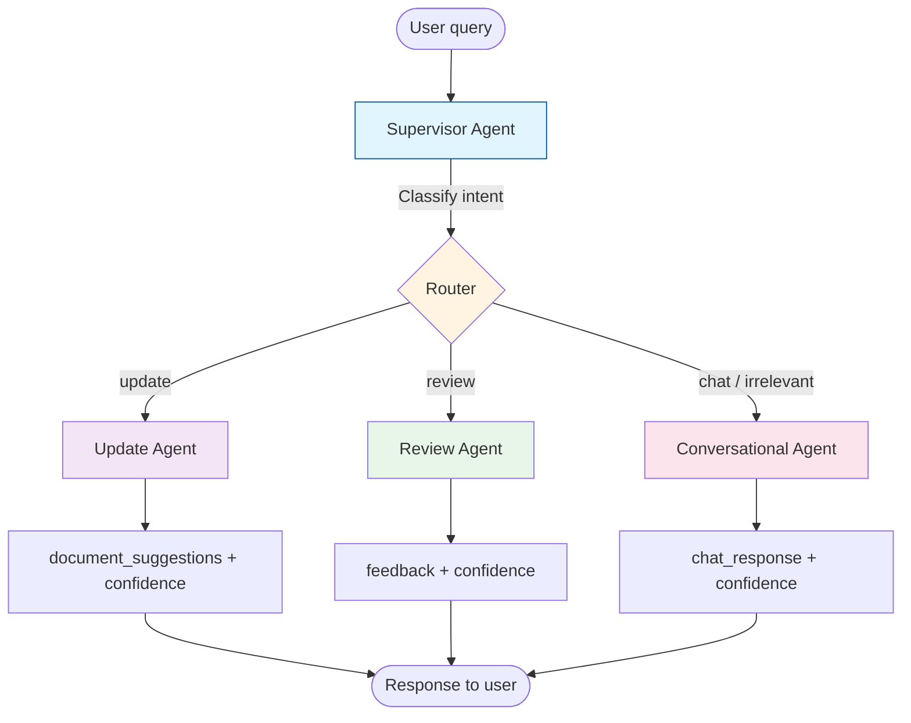
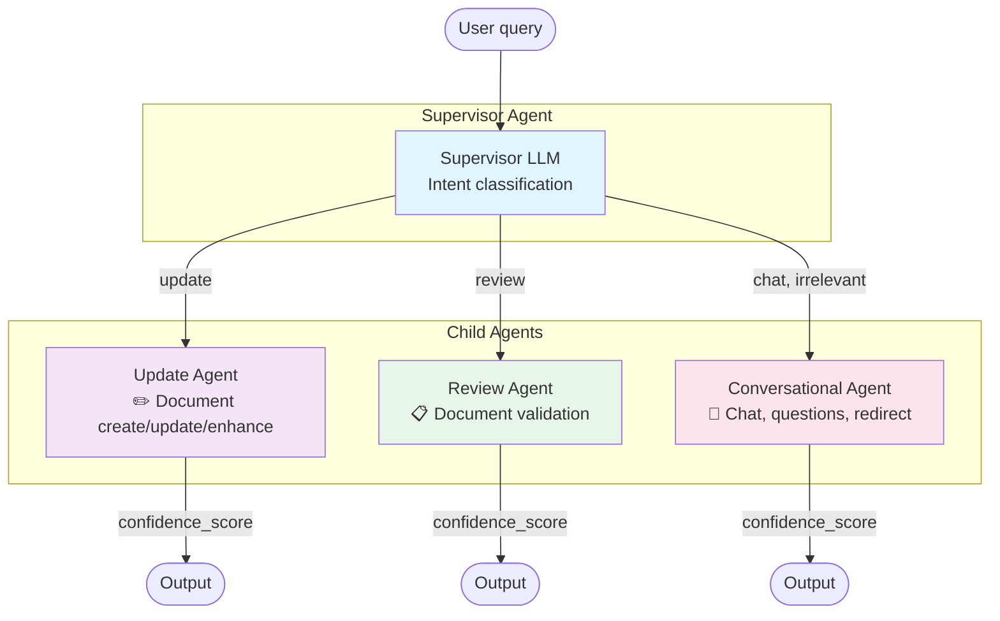
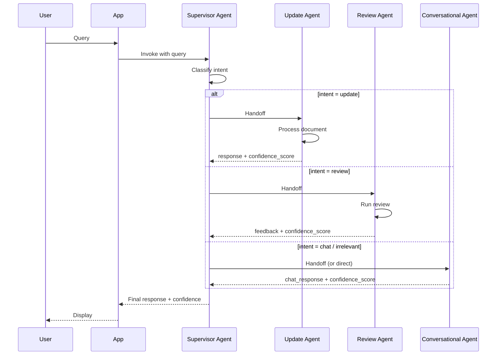
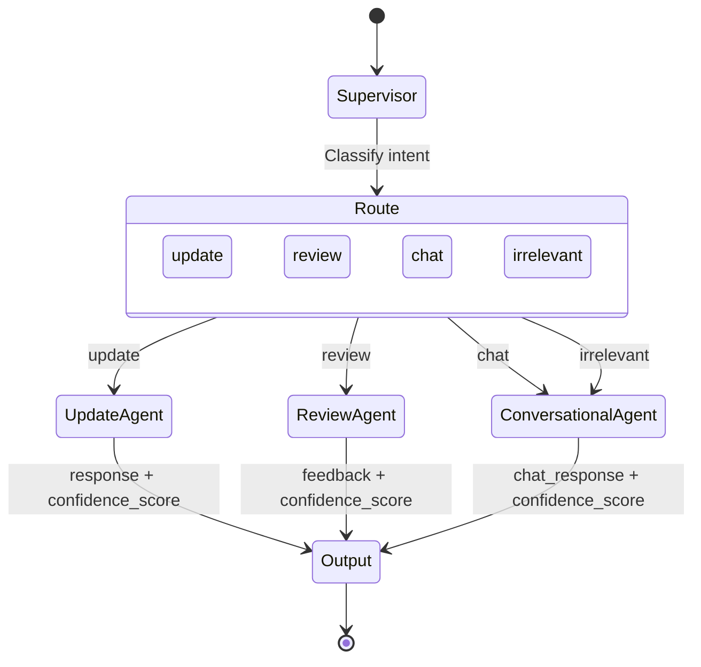

# Agent Architecture — Mermaid Diagrams

Two flows:

1. **Document-based flow** — User clicks a document section (User / System / Tech info) → triggers the corresponding agent → each returns a confidence score.
2. **Supervisor flow** — Supervisor receives user query → routes to Update Agent, Review Agent, or Conversational Agent based on intent.

---

## Flow 1: Document-Based Agent Triggers

Document has three sections. Clicking a section triggers its agent; each agent returns output plus a confidence score.

| Section            | Triggered agent    | Output                 |
|--------------------|--------------------|------------------------|
| User Information   | User Info Agent    | Response + confidence  |
| System Information | System Info Agent  | Response + confidence  |
| Tech Information   | Tech Info Agent    | Response + confidence  |

---

## Flow 2: Supervisor Agent with Child Agents

User sends a query → **Supervisor Agent** classifies intent → routes to one of three child agents.

| Child Agent           | When triggered       | Role                            |
|-----------------------|------------------------|---------------------------------|
| **Update Agent**      | intent = update       | Create, update, or enhance doc |
| **Review Agent**      | intent = review       | Validate and review document    |
| **Conversational Agent** | intent = chat, irrelevant | Answer questions, redirect, chat |

---

## Summary

| Flow        | Trigger              | Agents                                                | Output                 |
|------------|----------------------|--------------------------------------------------------|------------------------|
| **Document** | Click section (User / System / Tech) | User Info Agent, System Info Agent, Tech Info Agent | Response + confidence  |
| **Supervisor** | User query           | Supervisor → Update / Review / Conversational Agent   | Response + confidence  |
