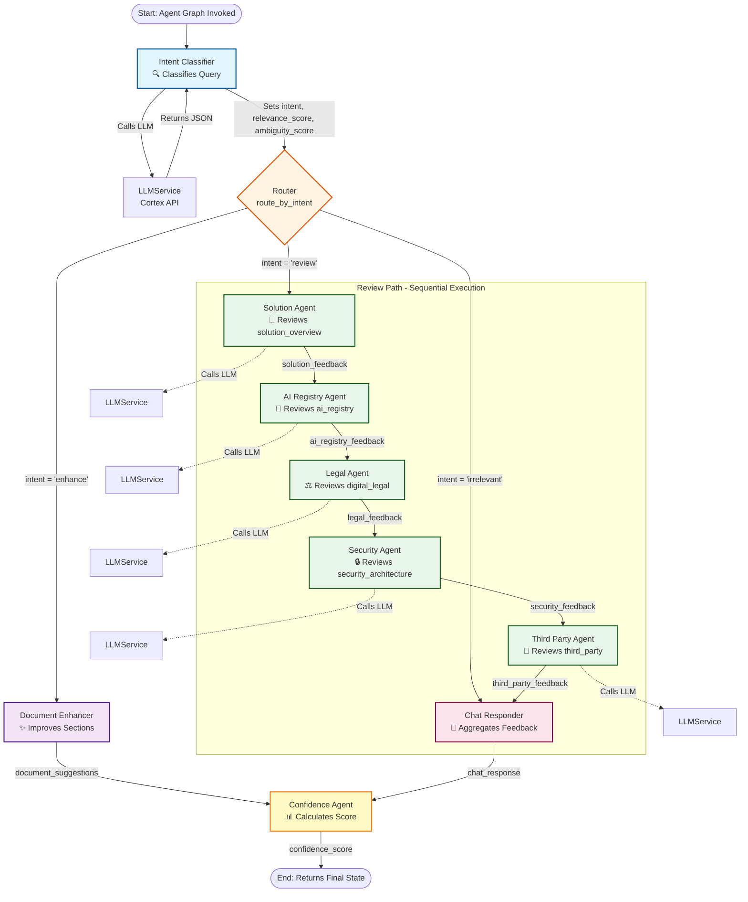
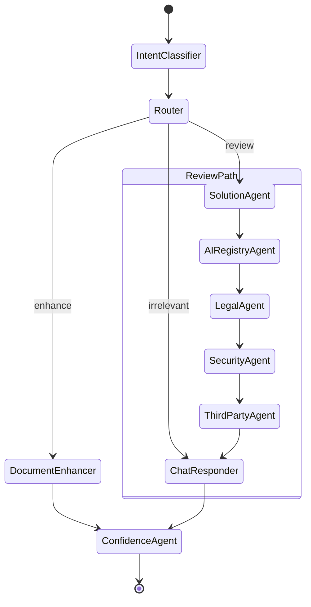

# Agent Architecture - Mermaid Diagrams

## Agent Graph Flow Diagram

```mermaid
graph TB
    START([Start: Agent Graph Invoked]) --> INTENT[Intent Classifier<br/>🔍 Classifies Query]
    
    INTENT -->|Calls LLM| LLM1[LLMService<br/>Cortex API]
    LLM1 -->|Returns JSON| INTENT
    
    INTENT -->|Sets intent, relevance_score, ambiguity_score| ROUTE{Router<br/>route_by_intent}
    
    ROUTE -->|intent = 'irrelevant'| RESPOND[Chat Responder<br/>📝 Aggregates Feedback]
    ROUTE -->|intent = 'enhance'| ENHANCE[Document Enhancer<br/>✨ Improves Sections]
    ROUTE -->|intent = 'review'| SOL[Solution Agent<br/>🔧 Reviews solution_overview]
    
    subgraph "Review Path - Sequential Execution"
        SOL -->|solution_feedback| AI[AI Registry Agent<br/>🤖 Reviews ai_registry]
        AI -->|ai_registry_feedback| LEGAL[Legal Agent<br/>⚖️ Reviews digital_legal]
        LEGAL -->|legal_feedback| SEC[Security Agent<br/>🔒 Reviews security_architecture]
        SEC -->|security_feedback| TP[Third Party Agent<br/>🤝 Reviews third_party]
        TP -->|third_party_feedback| RESPOND
    end
    
    SOL -.->|Calls LLM| LLM2[LLMService]
    AI -.->|Calls LLM| LLM3[LLMService]
    LEGAL -.->|Calls LLM| LLM4[LLMService]
    SEC -.->|Calls LLM| LLM5[LLMService]
    TP -.->|Calls LLM| LLM6[LLMService]
    
    ENHANCE -->|document_suggestions| CONF[Confidence Agent<br/>📊 Calculates Score]
    RESPOND -->|chat_response| CONF
    
    CONF -->|confidence_score| END([End: Returns Final State])
    
    style INTENT fill:#e1f5ff,stroke:#01579b,stroke-width:2px
    style ROUTE fill:#fff4e1,stroke:#e65100,stroke-width:2px
    style SOL fill:#e8f5e9,stroke:#1b5e20,stroke-width:2px
    style AI fill:#e8f5e9,stroke:#1b5e20,stroke-width:2px
    style LEGAL fill:#e8f5e9,stroke:#1b5e20,stroke-width:2px
    style SEC fill:#e8f5e9,stroke:#1b5e20,stroke-width:2px
    style TP fill:#e8f5e9,stroke:#1b5e20,stroke-width:2px
    style ENHANCE fill:#f3e5f5,stroke:#4a148c,stroke-width:2px
    style RESPOND fill:#fce4ec,stroke:#880e4f,stroke-width:2px
    style CONF fill:#fff9c4,stroke:#f57f17,stroke-width:2px
```

## Agent State Flow Diagram (Fixed)

```mermaid
stateDiagram-v2
    [*] --> IntentClassifier
    
    IntentClassifier --> Router
    
    Router --> SolutionAgent: review
    Router --> DocumentEnhancer: enhance
    Router --> ChatResponder: irrelevant
    
    state ReviewPath {
        SolutionAgent --> AIRegistryAgent
        AIRegistryAgent --> LegalAgent
        LegalAgent --> SecurityAgent
        SecurityAgent --> ThirdPartyAgent
        ThirdPartyAgent --> ChatResponder
    }
    
    DocumentEnhancer --> ConfidenceAgent
    ChatResponder --> ConfidenceAgent
    ConfidenceAgent --> [*]
```
