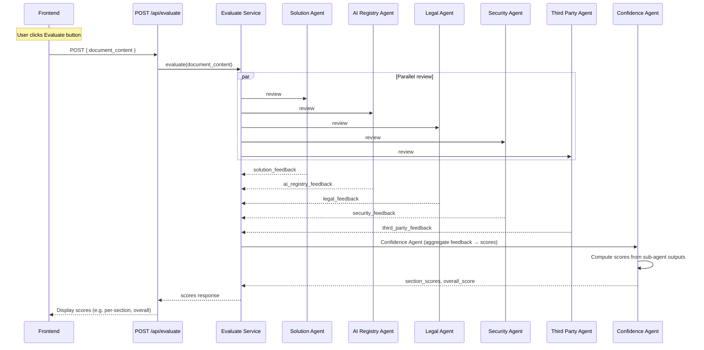
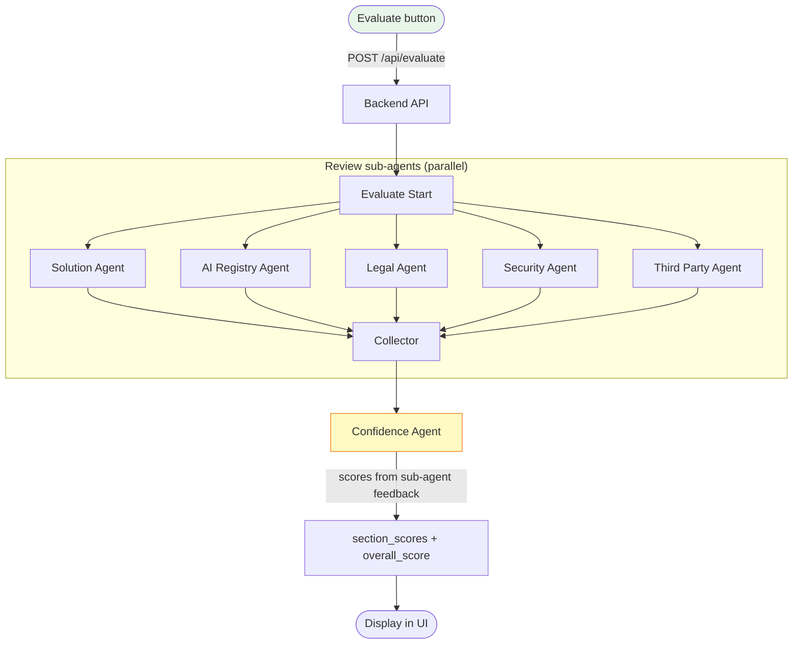
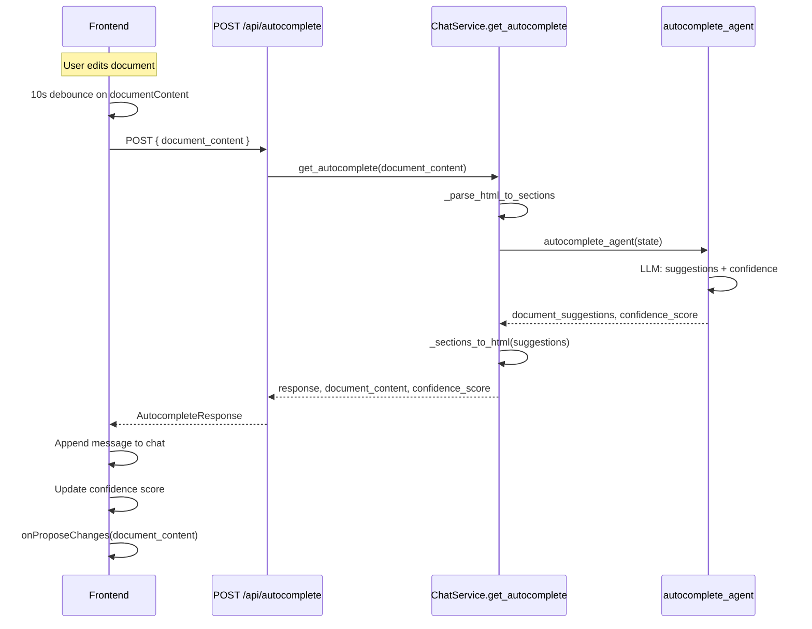
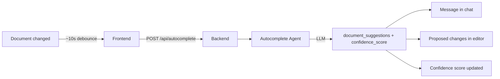

# Agent Architecture - Mermaid Diagrams

## Intent Taxonomy

Every user message is classified into exactly one intent:

| Intent       | Description |
|-------------|-------------|
| **irrelevant** | Greetings, casual chat, off-topic. |
| **chat**       | Questions about the app/document/review (no document change). |
| **update**     | Create, update, or enhance the document (from scratch, sections, or lines). |
| **review**     | Review/validate the document (runs parallel review agents). |

---

## Agent Graph Flow (Intent-Driven)

This graph is invoked on **POST /api/chat** with `user_query`, `document`, and `chat_history`.

---

## Agent State Flow (Intent-Driven)

---

## Evaluate Flow — Confidence Agent (Separate from Chat)

The **Confidence Agent** is a separate flow triggered by the **"Evaluate" button** in the UI and invoked via **POST /api/evaluate**. It uses the same review sub-agents (Solution, AI Registry, Legal, Security, Third Party) to produce **scores** based on their feedback—similar to the review path but with scores instead of a chat summary.

- **Trigger:** User clicks **Evaluate** → API call with current document.
- **Flow:** Runs all five review sub-agents in parallel → **Confidence Agent** aggregates their feedback and computes section-level and/or overall scores.
- **Output:** Scores (per section or overall) for display in the UI.

---

## Autocomplete Flow (Separate from Intent Graph)

The **Autocomplete Agent** is **not** in the main graph. It is triggered by the **frontend** ~10 seconds after the document content changes, and called via **POST /api/autocomplete** with only the current document.

- **Input:** `document_content` (current editor HTML).
- **Output:** Chat message (gaps/suggestions), proposed document HTML (accept/reject in UI), updated confidence score.

---

## Summary

| Component            | Trigger              | Result |
|---------------------|----------------------|--------|
| Intent classifier   | Every /api/chat      | Routes to respond / enhance / review_start. |
| Chat responder      | irrelevant, chat, or after review | Chat message (with document + history context). |
| Document updater    | intent = update      | document_suggestions → HTML → UI proposed changes. |
| Review agents       | intent = review      | Parallel feedback → chat responder → confidence scorer. |
| Confidence scorer   | After respond or enhance (in chat flow) | confidence_score (0–100) from relevance + ambiguity. |
| **Confidence agent**| **Evaluate button → POST /api/evaluate** | **Runs review sub-agents → aggregates feedback → produces section/overall scores.** |
| Autocomplete agent  | Frontend 10s after doc change | Chat message + proposed document + new confidence (separate API). |
