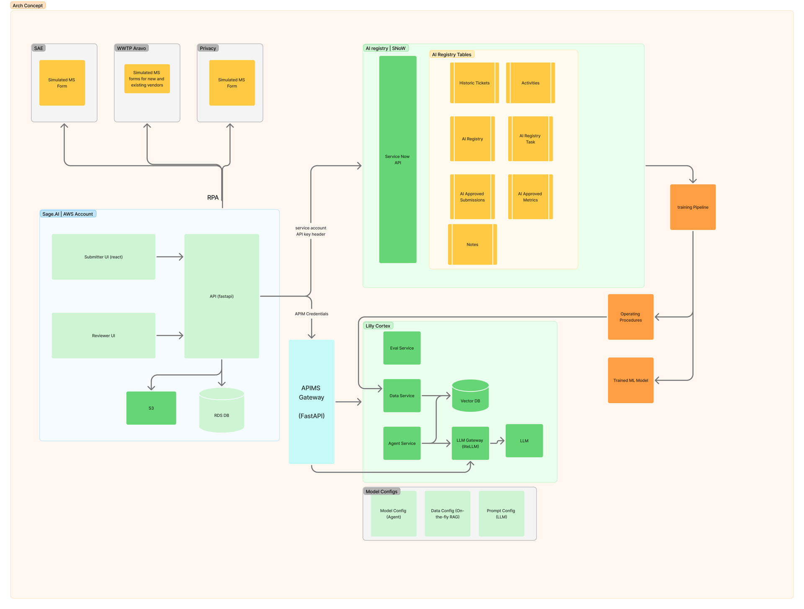
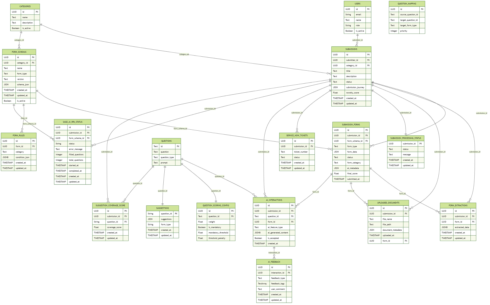

# Sage AI Backend (BE)

## Architecture Summary

The backend is a FastAPI service that orchestrates idea submission, AI-assisted document extraction, scoring, suggestions, semantic search, and ServiceNow integration. Requests flow through modular routers to services and clients, persisting state in PostgreSQL and emitting traces/metrics for observability.

- Core: FastAPI app (`main.py`), modular routers under `data_service/routes/*`
- Services/Clients: `data_service/service/*`, `data_service/clients/*` (Cortex/LLM Gateway, S3, ServiceNow)
- Persistence: PostgreSQL via SQLAlchemy models in `data_service/models/*`
- Observability: OpenTelemetry (OTLP) + Prometheus metrics

Architecture diagram:



## Data Model Summary

The data model centers on `submissions` and `submission_forms`, with related entities for uploaded documents, AI extractions and interactions, feedback, scoring, categories, users, ServiceNow tickets, and RPA status.

- Submissions capture top-level idea metadata and journey
- Submission forms store per-form JSON data, status, and AI metadata
- Uploaded documents link files to submissions/forms
- Form extractions persist AI-derived answers and provenance
- AI interactions/feedback record feature usage and user feedback
- Scoring and suggestions tables support coverage and static recommendations
- ServiceNow tickets and RPA status track downstream automation

Model diagram:



A FastAPI service powering idea submissions, AI-assisted form completion, document extraction, suggestions, scoring, ServiceNow ticketing, and semantic search.

## At a Glance

- Framework: FastAPI + SQLAlchemy (async), Pydantic, Alembic
- Data: PostgreSQL (JSON/JSONB), S3 for uploads, FAISS for search
- AI: Cortex and/or LLM Gateway for extraction and enhancements
- Realtime: SSE progress for background document processing
- Observability: Prometheus metrics, OpenTelemetry tracing

## Architecture

See `documentations/SAGE_AI_BE_TECHNICAL_DOCUMENTATION.md` for details.


## Data Model

Entity relationships for key domains (Submissions, Forms, Users, AI Interactions, Scoring, ServiceNow, RPA).


Short Summary:
- FE → BE via FastAPI routes; BE orchestrates DB, S3, FAISS, and external AI/ServiceNow.
- Background extraction updates status and streams progress via SSE.
- Core domains: submissions, forms, AI interactions, scoring, ServiceNow, RPA status.

## Documentation

- Backend Technical Doc: `documentations/SAGE_AI_BE_TECHNICAL_DOCUMENTATION.md` 
- The documentations/SAGE_AI_BE_TECHNICAL_DOCUMENTATION.md explains the architecture and service layers, API endpoints
- FastAPI backend powering idea submissions, form workflows.
- Persists data in PostgreSQL (JSON/JSONB) via SQLAlchemy/Alembic; streams background progress to FE via SSE.


- AI Technical Doc: `documentations/SAGE_AI_TECHNICAL_DOCUMENTATION.md` 
The documentations/SAGE_AI_TECHNICAL_DOCUMENTATION.md explains the AI features used in BE:
Document Extract: pulls answers from uploaded files using hybrid retrieval (BM25 + embeddings) with provenance.
Enhance Answer: rewrites user text for clarity/structure while preserving the original intent.
Check Coverage: evaluates required/optional fields against thresholds, applies weights/penalties, and returns coverage metrics + final score.
Confidence Score: responses include per-answer confidence to aid ranking and UX.


## Run Backend Code

    ```
    poetry run uvicorn main:app --host 0.0.0.0 --port 8080 --reload           
    ```

## Local Postres Setup

1. Setup .env File
    ```
    DB_NAME = DB_NAME
    DB_USER = DB_USER
    DB_PASSWORD = DB_PASSWORD
    DB_HOST = localhost
    DB_PORT = 5432
    DB_POOL_SIZE = 5
    DB_MAX_OVERFLOW = 10
    DB_POOL_TIMEOUT = 60
    ```

2. Pull Postgres Docker Image
    ```
    podman pull postgres:15
    ```

3. Run Postgres Container
    ```
    podman run --name sage_postgres -e POSTGRES_DB=DB_NAME -e POSTGRES_USER=DB_USER -e POSTGRES_PASSWORD=DB_PASSWORD -p 5432:5432 -d postgres:15
    ```

## Create database migrations using Alembic

### Steps

1. If this is a fresh project, initialize Alembic by running:
    ```bash
    poetry run alembic init alembic
    ```

2. Run the alembic migration command after adding or updating SqlAlchemy models:
    ``` bash
    poetry run alembic revision --autogenerate -m "Change description"
    ```

3. Update the database state with the latest migration:
    ``` bash
    poetry run alembic upgrade head
    ```
    